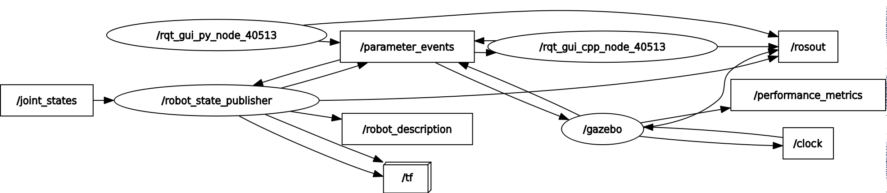

# ur5e sim

This package is for simulation of UR5e robot, it contains the following:

- Mesh files for robot components.
- URDF of the robot.
- Rviz visualization of the robot.
- Gazebo visualization of the robot.

## Dependencies

- ros2 humble
- gazebo
- gazebo_ros
- xacro
- urdf
- joint_state_publisher_gui
- robot_state_publisher
- rviz2

## Running the simulation

- Create a workspace

```bash
~$ mkdir ur5e_ws/src -p
```

- Clone the repo

```bash
~$ cd ur5e_ws/src
~/ur5e_ws/src$ git clone git@github.com:zaki-x86/ur5e_sim.git
```

- Move to the workspace and build the package

```bash
~$ cd ~/ur5e_ws
~/ur5e_ws$ colcon build
```

- Source the package

```bash
~/ur5e_ws$ . install/setup.sh
```

- Setup the models up to be visible for Gazebo

```bash
~/ur5e_ws$ bash src/ur5e_sim/scripts/setup_models.sh
```

- Start the simulation

```bash
~/ur5e_ws$ ros2 launch ur5e_sim gz_sim.launch.py
```


The following launch files are available:

- `ur5e.launch.py`: runs `robot_state_publisher` that publishes the urdf of the robot via `/robot_description` topic.
- `rviz_sim.launch.py`: runs `rviz2` simulation and `joint_state_publisher_gui` for visualizing robot movements.
- `gazebo_sim.launch.py`: runs gazebo world with the robot in it. 

The `robot_state_publisher` is run by `ur5e.launch.py` launcher, the launch file compiles the xacro files and generates the urdf of the robot, then it is passed as a parameter to the `robot_state_publisher` node.

The `robot_state_publisher` publishes the urdf of the robot via `/robot_description` topic, both `rviz` and `gazebo` subscribe to this topic to get the robot's urdf.

Here's the node graph when running the gazebo simulation with `gz_sim.launch.py` launch file:


